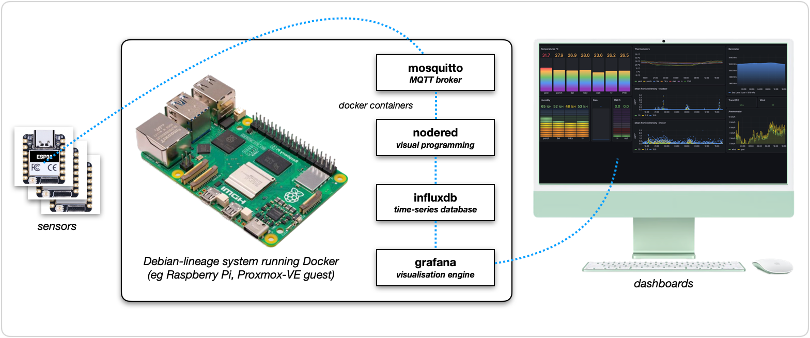
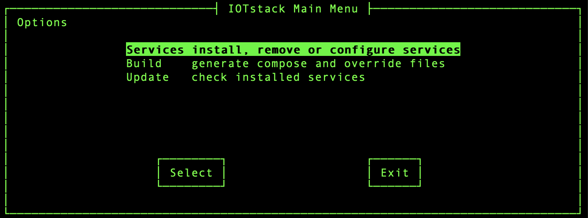
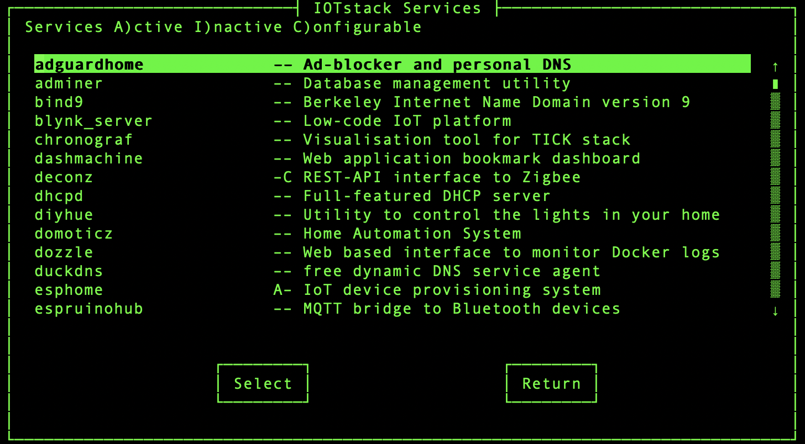
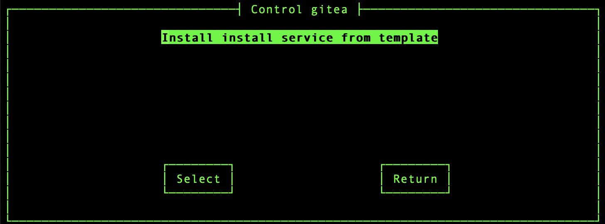
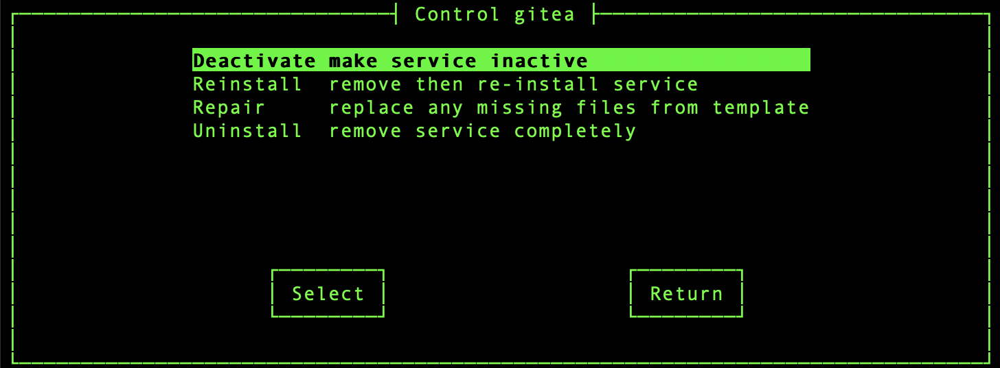
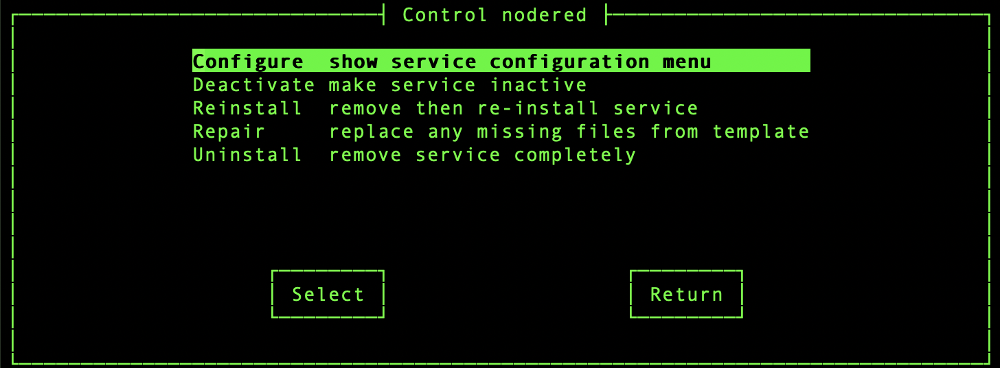
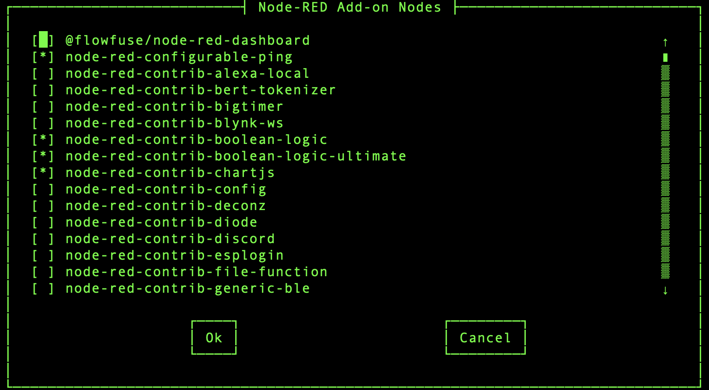
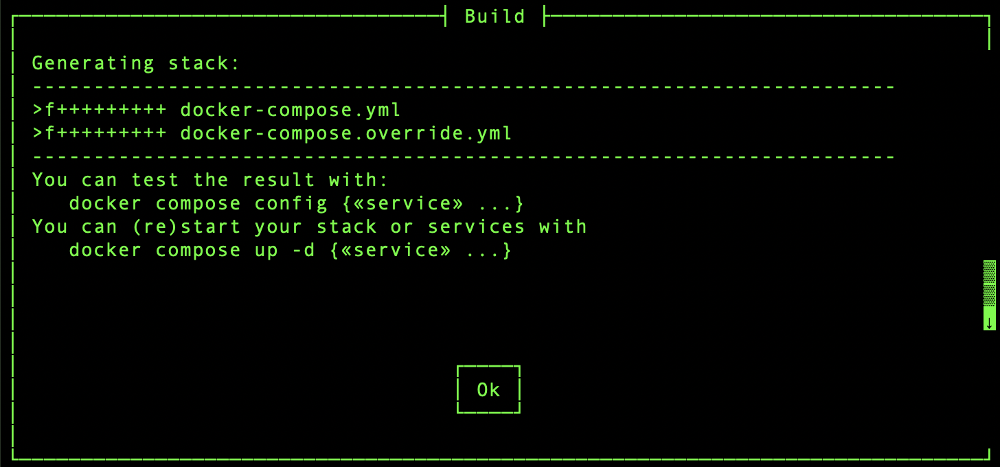
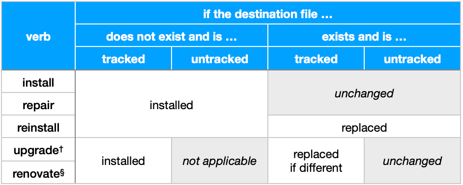
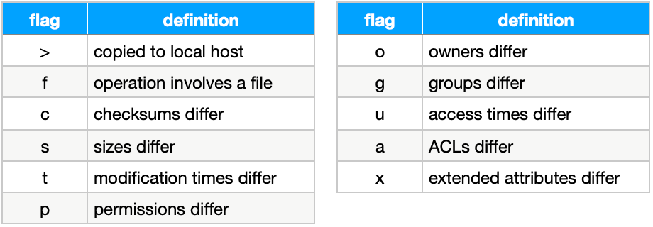

# IOTstack with `iotstack-menu.sh`

IOTstack helps you to create Internet-of-Things "stacks" on Debian-lineage Linux systems such as the Raspberry Pi. A *stack* is a collection of *Docker* containers which is managed by *docker&nbsp;compose*. Many makers start with the so-called "MING stack":

* **M***osquitto* (a broker for the MQTT data-communications protocol)
* **I***nfluxDB* (a database management system optimised for time-series data)
* **N***ode-RED* (a visual programming environment)
* **G***rafana* (a visualisation engine) 

[Figure&nbsp;1](#figure1) shows a common pattern for implementing the *MING stack:*

| <a name="figure1"></a> Figure 1: MING Stack |
|:-------------------------------------------:|
|  |

In words:

1. Sensors, which typically run on low-powered devices like the ESP32 or ESP8266, use the MQTT protocol to *publish* observations (eg temperature readings) to Mosquitto (an MQTT *broker*).
2. Node-RED "flows" *subscribe* to the observations, extract the data from the MQTT payloads, and repackage it for insertion into a time-series database managed by InfluxDB.
3. You use a browser to interact with Grafana, to both create and view dashboards. Grafana generates the queries needed to fetch sensor data from InfluxDB, then constructs charts to summarise your data in visual form.

<a name="about"></a>
## about this document

This document describes (yet another) menu system for IOTstack. The original README can be found [here](./README-original.md).

If you are new to IOTstack, you should probably read [Getting Started](./docs/Basic_setup/index.md) before doing anything else.

If you would like to try out this menu, please see [user testing](#user-testing). It explains how to augment an existing IOTstack installation to run this new menu.

<a name="background"></a>
## background

IOTstack was the brainchild of Graham Garner. Deployed in July 2019, Graham's menu system was based on `bash` and `whiptail`. It followed the approach of copying docker compose service definition templates into a staging area, then concatenating the staged files to form the compose file. Users could customise the staged files and run the menu to recreate the compose file. If a template changed *and the user was aware of it*, the user could "pull full service from template" to adopt the revised service definition, albeit at the cost of losing any customisations. There was no inherent support for override files. Graham's original menu is still available on the `old-menu` branch. 

The last evidence we have of Graham being active was a post on Discord on Feb 26 2020 and a commit on GitHub on Apr 25 2020. In mid 2020, Andreas Spiess (*SensorsIot* - "the guy with the Swiss accent") forked Graham's repository so development could continue. Steven Lawler (*Slyke*) added what is generally referred to as the "new menu" and is what you get by default if you clone IOTstack from GitHub. Slyke's menu was implemented using a mixture of `bash` and Python. Best described as a *parsing* and *assembly* engine, rather than a *concatenation* engine, it only uses the staging area when necessary (eg Node-RED). Customisation is via an override scheme which is peculiar to new menu, and which is different from but can co-exist with the override mechanism supported by *docker&nbsp;compose*.

I'm Phill Kelley (*Paraphraser*). People who follow my comments on Discord and GitHub will know that I have never been a huge fan of either menu system. The advice I've usually given is to use the menu (either old or new) to get started, study how everything hangs together, and then just use a text editor on the compose file. My objections to the existing menus concern how they don't really offer much beyond getting started. For example:

* The menus are good at adding and deleting services but are not good at letting you know about changes to the templates of the services you are using, or doing things like temporarily inactivating a service in a non-destructive way.
* At least on my systems, new menu constantly flickers and repaints, and often winds up with menu artefacts scattered all over the screen.
* I have nothing against Python but it has proven to be a bit of a moving target. Every major Debian release seems to bring more restrictions (eg `venv` and the need to pass the `--break-system-packages` flag). In comparison, `bash` is stable and `whiptail` is time-tested.

I've long wanted a menu system with the following characteristics:

1. Is based on `bash` and `whiptail`.
2. Offers both menu and command line interfaces to support scripting.
3. Can install, uninstall, repair, deactivate, and reactivate services.
4. Supports *docker&nbsp;compose's* native override scheme (so you can use its debugging tools). 
4. Supports the well-known and well-understood `update` and `upgrade` pattern (eg `apt`) so that you can easily find out when templates change, can upgrade when appropriate, and at least get you started on the path of figuring out what changed.

<hr>

## table of contents

- [introducing `iotstack-menu.sh`](#script-intro)
- [quick tour](#menu-tour)

	- [services menu](#services-menu)

		- [service install](#control-menu-install)
		- [service control](#control-menu-installed)
		- [service configuration](#control-menu-configure)

	- [build menu](#build-menu)

- [command-line verbs](#cli-mode)

	- [activate](#verb-activate)
	- [build](#verb-build)
	- [configure](#verb-configure)
	- [deactivate](#verb-deactivate)
	- [help](#verb-help)
	- [inspect](#verb-inspect)
	- [install](#verb-install)
	- [reinstall](#verb-reinstall)
	- [reload](#verb-reload)
	- [renovate](#verb-renovate)
	- [repair](#verb-repair)
	- [services](#verb-services)
	- [status](#verb-status)
	- [uninstall](#verb-uninstall)
	- [update](#verb-update)
	- [upgrade](#verb-upgrade)
	- [bashcompletions](#verb-bashcompletions)

- [file copying](#rsync-actions)

	- [rsync flags](#rsync-flags)

- [user testing](#user-testing)
- [see also](#references)

<hr>

<a name="script-intro"></a>
## `iotstack-menu.sh`

The `iotstack-menu.sh` script is a replacement for `menu.sh` (either "old" or "new" menus). In this documentation, it will simply be called *the menu.* As was the case for the previous menus, you should always set your working directory correctly before running the menu:

``` console
$ cd ~/IOTstack
```

The menu operates in two modes. When invoked:

* **without** arguments:

	``` console
	$ ./iotstack-menu.sh
	```

	it enters *menu mode* where choices are displayed using `whiptail` menus. This is sometimes referred to as a Terminal User Interface (TUI). The only fixed requirements are minimum screen dimensions of 80 columns and 24 lines. If your screen is smaller, the script will exit with the message:

	```
	Error: Your screen needs a minimum width of 80 columns plus
	       at least 24 lines. Please adjust the size of your
	       terminal window. Alternatively, use command-line mode.
	```

* **with** arguments, such as:

	``` console
	$ ./iotstack-menu.sh help
	```

	it runs in *command-line mode* where it processes the arguments and exits.

In command-line mode, the menu supports `bash` auto-completion. Auto-completion triggers on the command. A command like `./menu.sh` creates some risk of confusion for the auto-completion system so a slightly less ambiguous name is warranted. That's why this version of the menu breaks with tradition and uses `./iotstack-menu.sh` instead.

<a name="menu-tour"></a>
## quick tour

Launching the menu without arguments displays the main menu:

| <a name="figure2"></a> Figure 2: Main menu |
|:------------------------------------------:|
|   |

You can move the cursor (highlight) by:

- Using the <kbd><!--up arrow-->&#x2B61;</kbd> and <kbd><!--down arrow-->&#x2B63;</kbd> arrow keys; or
- Pressing the first letter of a command (eg <kbd>u</kbd> jumps straight to "Update")

You can execute the command associated with the cursor by:

- Pressing <kbd>enter</kbd>; or
- Using the <kbd><!--left arrow-->&#x2B60;</kbd>, <kbd><!--right arrow-->&#x2B62;</kbd> or <kbd>tab</kbd> keys until the cursor moves to the "Select" button, and then pressing <kbd>enter</kbd>

You can leave the menu by:

- Using the <kbd><!--left arrow-->&#x2B60;</kbd>, <kbd><!--right arrow-->&#x2B62;</kbd> or <kbd>tab</kbd> keys until the cursor moves to the "Exit" button, and then pressing <kbd>enter</kbd>; or
- Pressing <kbd>esc</kbd>

The same basic navigation patterns apply to most menu screens.
   
<a name="services-menu"></a>
### services menu

Choosing "Services" displays the list of services (*Docker* containers) supported by IOTstack:

| <a name="figure3"></a> Figure 3: Services menu   |
|:------------------------------------------------:|
| |

The list is in alphabetical order, is scrollable, and you can press letter keys to jump around. For example, pressing <kbd>n</kbd> jumps to the first service beginning with "n" which, currently, is `n8n`.

Each row shows the name of the service plus a short description. In between the name and the description are two characters. The possible meanings of the first character are:

* `-` the service is uninstalled
* `A` the service is installed and active
* `I` the service is installed but inactive

The possible meanings of the second character are:

* `-` the service is not configurable
* `C` the service is configurable.

In the Services menu ([Figure&nbsp;3](#figure3)), `esphome` and `grafana` are active, while `deconz` is not installed but, were it to be installed, it would also be configurable.

The equivalent command in the CLI is:

``` console
$ ./iotstack-menu.sh status
```

<a name="control-menu-install"></a>
#### service install

Suppose you want to install Gitea. Place the cursor on that service and press <kbd>enter</kbd>. The only option is to "Install" the service:

| <a name="figure4"></a> Figure 4: Control menu – install Gitea   |
|:---------------------------------------------------------------:|
| |

After you install Gitea, the Services menu ([Figure&nbsp;3](#figure3)) will change to show that the service is installed and active:

```
gitea                   A– Self-hosted source code control
```

The equivalent CLI command is:

``` console
$ ./iotstack-menu.sh install gitea
```

<a name="control-menu-installed"></a>
#### service control

If you re-select Gitea in the Services menu ([Figure&nbsp;3](#figure3)), the Control menu adapts to reflect the fact that Gitea is installed:

| <a name="figure5"></a> Figure 5: Control menu – Gitea installed |
|:---------------------------------------------------------------:|
|         |

Now that Gitea is active, your choices are:

* **Deactivate**

	This preserves any customisations you may have made, while marking the service as not to be included the next time you "Build" your compose file. The equivalent CLI command is:

	``` console
	$ ./iotstack-menu.sh deactivate gitea
	```

* **Reinstall**

	This is a shortcut for an "Uninstall" followed by an "Install". The reinstalled service will be marked active and will be included the next time you "Build" your compose file. The equivalent CLI command is:

	``` console
	$ ./iotstack-menu.sh reinstall gitea
	```

	Please read [`uninstall`](#verb-uninstall) to understand which files are removed, renamed, or ignored.

* **Repair**

	Gitea's services sub-directory is preserved, as are any changes you may have made within that directory. Any **missing** files are replaced from the template. The equivalent CLI command is:

	``` console
	$ ./iotstack-menu.sh repair gitea
	```

* **Uninstall**

	The existing service will be marked "uninstalled" and will not be included the next time you "Build" your compose file. Please read [`uninstall`](#verb-uninstall) to understand how files are removed, renamed, or ignored. The equivalent CLI command is:

	``` console
	$ ./iotstack-menu.sh uninstall gitea
	```

It should be apparent that the contents of the Services ([Figure&nbsp;3](#figure3)), and Control ([Figure&nbsp;4](#figure4) and [Figure&nbsp;5](#figure5)) menus vary according to the status of the service. If you deactivate Gitea:

* the Services menu ([Figure&nbsp;3](#figure3)) will change to show that the service is inactive:

	```
	gitea                   I– Self-hosted source code control
	```

	This preserves any customisations you may have made, while marking the service as to be excluded the next time you "Build" your compose file.

* the Control menu ([Figure&nbsp;5](#figure5)) will replace "Deactivate" with "Activate".

<a name="control-menu-configure"></a>
#### service configuration

Node-RED is an example of a container that is configurable. Assuming Node-RED is installed, its Control menu will include a "Configure" option:

| <a name="figure6"></a> Figure 6: Control menu – Node-RED     |
|:------------------------------------------------------------:|
| |

If you apply what you learned about Gitea to what you see in [Figure&nbsp;6](#figure6), you should realise that the row for Node-RED in the Services menu ([Figure&nbsp;3](#figure3)) would have been:

```
nodered                 AC Low-code programming environment
```

Configuring Node-RED implies selecting one or more add-on nodes to be installed within the container when the local image is built. For Node-RED, choosing "Configure" results in [Figure&nbsp;7](#figure7), which is a list of add-on nodes:

| <a name="figure7"></a> Figure 7: Configure menu – Node-RED       |
|:----------------------------------------------------------------:|
| |

The equivalent CLI command is:

``` console
$ ./iotstack-menu.sh configure nodered
```

You can use <kbd><!--up arrow-->&#x2B61;</kbd> and <kbd><!--down arrow-->&#x2B63;</kbd>, plus <kbd>space</kbd> to toggle add-on nodes. When you are finished, choosing "Ok" will save your choices and return you to the Services menu ([Figure&nbsp;3](#figure3)).

<a name="build-menu"></a>
### build menu

Choosing "Build" assembles your compose and override files, and displays the following to confirm that the job has been done:

| <a name="figure8"></a> Figure 8: Build summary   |
|:------------------------------------------------:|
| |

The equivalent CLI command is:

``` console
$ ./iotstack-menu.sh build
```

In this example, the "`>f+`" [rsync flags](#rsync-flags) indicate that your compose and override files were created. In general, this will only happen the first time you run the "Build" command. Subsequently, typical flag patterns would be either:

* "`.f..t`" indicating that the only change to the associated file was to update its modification time; or

* "`>fcst`" indicating that the newly-generated file differed from the previous version, in which case the older file was renamed with a `.save` extension.

You can then start your stack with:

``` console
$ docker compose up -d
```

<a name="cli-mode"></a>
## command-line verbs

<a name="verb-activate"></a>
### activate

Usage:

``` console
$ ./iotstack-menu.sh activate «service» {«service»...}
```

Activates at least one inactive service. If a named `«service»` is not inactive, returns:

```
Warning: «service» is not inactive
```

> Apologies for the double-negative in `not inactive` but it's precise.

<a name="verb-build"></a>
### build

Builds your stack.

Usage:

``` console
$ ./iotstack-menu.sh build
```

See also the [build process](./docs/Developers/BuildStack-Services.md).

<a name="verb-configure"></a>
### configure

Usage:

``` console
$ ./iotstack-menu.sh configure «service»
```

Providing the named `«service»` is configurable, this will invoke the service's configuration script in exactly the same way as the "Configuration" command in the Services menu ([Figure&nbsp;3](#figure3)).

If the service is not configurable, exits with:

```
Warning: «service» is not configurable
```

<a name="verb-deactivate"></a>
### deactivate

Usage:

``` console
$ ./iotstack-menu.sh deactivate «service» {«service»...}
```

Deactivates at least one active service. If a named `«service»` is not active, returns:

```
Warning: «service» is not active
```

Deactivation does not change anything in the service's sub-directory. It is a change of status in the internal database which prevents the service from being included the next time you [build](#verb-build) your stack.

<a name="verb-help"></a>
### help

Usage:

``` console
$ ./iotstack-menu.sh help
```

Displays a list of available commands.

<a name="verb-inspect"></a>
### inspect

Usage:

``` console
$ ./iotstack-menu.sh inspect «service»
```

This is a convenience command. It retrieves the service's JSON configration from the internal database, then invokes `jq` to display the configuration. Then it iterates the list of files that would be installed, printing each if Linux considers the file to be ASCII text.

Note:

* A service's `menu-config.json` will only make it into the database in the first place if SQLite3 is able to parse the file successfully. Being retrieved and displayed by `jq` represents an additional level of syntactic validation.

<a name="verb-install"></a>
### install

Usage:

``` console
$ ./iotstack-menu.sh install «service» {«service»...}
```

If `«service»` is not installed then it will be installed. If the service is already installed then any missing files will be re-installed. Existing files will never be overwritten. The service will be marked active.

Tip:

* The quickest way to construct a classic MING stack:

	``` console
	$ ./iotstack-menu install mosquitto influxdb nodered grafana
	$ ./iotstack-menu build
	$ docker compose up -d
	```

<a name="verb-reinstall"></a>
### reinstall

Usage:

``` console
$ ./iotstack-menu.sh reinstall «service» {«service»...}
```

This is a shortcut for `uninstall` followed by `install`. The result will always be an installed active service, irrespective of whether the service was or was not active beforehand. Please read [`uninstall`](#verb-uninstall) to understand which files are removed, renamed, or ignored.

<a name="verb-reload"></a>
### reload

Usage:

``` console
$ ./iotstack-menu.sh reload
```

Performs service discovery and updates the internal database. The menu mostly reloads the database automatically when necessary. However, you will need to invoke this command yourself if you are developing a new service.

<a name="verb-renovate"></a>
### renovate

Key concepts:

* [*structural* files](./docs/Updates/index.md#structure-vs-contents)
* [*renovation*](./docs/Updates/index.md#maint-structural)

Usage:

``` console
$ ./iotstack-menu.sh renovate
```

In command-line mode, the menu will tell you when a renovation is required:

```
Warning: headers/footers in ./services need renovation. Recommend running:
           ./iotstack-menu.sh renovate
         then compare any .save files (your versions) with the newer
         replacements, and re-apply your customisations.
```

In menu mode, the menu signals that a renovation is needed by adding the "Renovate" option to the Main menu.

It is up to you to decide whether to act on the suggestion, or defer it to a more convenient time. If you decide to renovate then the menu will list any changes it has made.

The tracked structural files that can be affected by a renovation are:

```
~/IOTstack/services/
├── docker-compose-header.yml
└── docker-compose-trailer.yml
```

If the commit&nbsp;ID of the master version of either file in the *templates* directory differs from the commit&nbsp;ID for that file stored in the internal database, then `rsync` is called to replace the file in the *services* directory with a fresh copy from the *templates* directory, providing that the two files differ, in which case the older version in the *services* directory is renamed with a `.save` extension.

If the `renovate` command reports changes, you should:

1. Go into the *services* directory and inspect it.

	``` console
	$ cd services ; ls *.save
	```

2. If there are any `.save` files, compare the relevant files. For example:

	``` console
	$ diff -y docker-compose-header.yml.save docker-compose-header.yml
	```

3. If you have any customisations in the `.save` file that you wish to preserve, migrate those manually to the replacement file, and then rebuild your stack.

Note:

* Confining your customiastions to the corresponding override files reduces your workload considerably.

<a name="verb-repair"></a>
### repair

Usage:

``` console
$ ./iotstack-menu.sh repair «service» {«service»...}
```

The `install` and `repair` verbs actually have **identical** behaviour. The reason the menu has two commands doing the same job is a psychological aid. If you know a service needs to be *repaired*, it may seem counter-intuitive to invoke `install`, and equally counter-intuitive to invoke `repair` if you're trying to *install* a service. This distinction also shows up in menu mode. Compare the two variations of the Control menu:

* [Figure&nbsp;4](#figure4) where Gitea is uninstalled, so it makes sense for the menu to present the "Install" option;
* [Figure&nbsp;5](#figure5) where Gitea is already installed, so it makes sense for the menu to present the "Repair" option.

<a name="verb-services"></a>
### services

``` console
$ ./iotstack-menu.sh services
```

Displays a compact list in alphabetical order of all services known to IOTstack, arranged in column format.

Each service carries a prefix as follows:

* `-:` service is not installed 
* `A:` service is installed and active (will be included in `docker-compose.yml` on each [build](#verb-build)).
* `I:` service is installed but is marked inactive (will not be included in `docker-compose.yml` on each [build](#verb-build)).
* `U:` service status is unknown. This is an internal error.

<a name="verb-status"></a>
### status

Usage:

``` console
$ ./iotstack-menu.sh status {«service»...}
```

If you omit the `«service»` arguments, the menu will display a full list of all known services along with whether each is active, inactive or uninstalled:

``` console
$ ./iotstack-menu.sh status
      active:             adguardhome Ad-blocker and personal DNS
 uninstalled:                 adminer Database management utility
 uninstalled:            blynk_server Low-code IoT platform
    inactive:              chronograf Visualisation tool for TICK stack
 uninstalled:             dashmachine Web application bookmark dashboard
 ...
```

If you pass one or more `«service»` arguments then you will get a more detailed display:

``` console
$ ./iotstack-menu.sh status chronograf nodered
      Service: chronograf
  Description: Visualisation tool for TICK stack
       Status: inactive
  Upgradeable: no
 Configurable: no

      Service: nodered
  Description: Low-code programming environment
       Status: active
  Upgradeable: no
 Configurable: yes
```

<a name="verb-uninstall"></a>
### uninstall

Usage:

``` console
$ ./iotstack-menu.sh uninstall «service» {«service»...}
```

Removes at least one named `«service»`.

The removal process iterates the files that would be installed by a corresponding [`install`](#verb-install). If a file exists in both *templates* and *services*, the two are compared. If they compare same, the copy in *services* is removed, otherwise it is renamed with a `.save` extension to try to preserve any customisations.

Files that are not installed by a corresponding [`install`](#verb-install) are not touched. The most common examples are `override.yml` files that you have created.

If a service's sub-directory winds up being empty, it is removed.

What this means in practice is that customisations should survive both an `uninstall` and a [`reinstall`](#verb-reinstall). However, you may need to compare re-installed files with their `.save` variants, and manually re-apply your customisations to the active files.

<a name="verb-update"></a>
### update

Key concepts:

* [*contents* files](./docs/Updates/index.md#structure-vs-contents)
* [*upgrade*](./docs/Updates/index.md#maint-services-upgrade)

Usage:

``` console
$ ./iotstack-menu.sh update
```

This command checks to see whether any installed service (either active or inactive) can be upgraded.

<a name="verb-upgrade"></a>
### upgrade

Usage:

``` console
$ ./iotstack-menu.sh upgrade «service» {«service»...}
```

This command performs an upgrade on at least one named `«service»`.

An `upgrade` only considers **tracked** files. For each tracked file, the menu compares the file's commit&nbsp;ID that is stored in the internal database with the commit&nbsp;ID returned by `git` when referencing that file in the *templates* directory.

If those commit&nbsp;IDs differ then it is implied that the **copy** that was made of the tracked file when it was copied *from* the *templates* directory *to* the service's sub-directory is out-of-date. The `rsync` command is called to make a new copy, with the proviso that the copy will only occur if the source and destination files differ, in which case the older destination file is renamed with a `.save` extension. 

Files that are not tracked are never upgraded. If you delete an untracked file from a service's sub-directory then you can get a new copy using [`repair`](#verb-repair).

<a name="verb-bashcompletions"></a>
### bashcompletions

``` console
$ ./iotstack-menu.sh bashcompletions
```

Prints the `bash` auto-completion handler for `iotstack-menu.sh`. In practice, it is best to use the `help` verb to make use of the `bashcompletions` verb. For example:

``` console
$ ./iotstack-menu.sh help | tail -4

  ./iotstack-menu.sh bashcompletions | sudo tee /etc/bash_completion.d/iotstack_menu_completions
    can be used to install bash auto-completion handler (logout needed)
```

The exact output you get on your system depends on the menu being able to find a suitable `bash_completion.d` on your system. Assuming it does, you can copy/paste the instructions:

``` console
$ ./iotstack-menu.sh bashcompletions | sudo tee /etc/bash_completion.d/iotstack_menu_completions
```

You need to logout and login again before the handler takes effect.

<a name="rsync-actions"></a>
## file copying

[Table&nbsp;1](#table1) summarises the actions taken by the various commands that involve copying files:

| <a name="table1"></a> Table 1: File copying summary      |
|:--------------------------------------------------------:|
|<br>*providing service<sup>†</sup> can be upgraded, or stack<sup>§</sup> can be renovated* |

The "upgrade" verb applies to each *service* as a whole. At least one of the service's tracked files must have changed before the service is considered a candidate for upgrading. Once a container qualifies for upgrading then **all** of its tracked files are checked:

* If there is no existing "installed" version, then the missing file is copied from the template; otherwise
* The "installed" version is compared with its template. If the files differ, then the existing file is renamed with a `.save` extension and replaced with a copy of the template. 

<a name="rsync-flags"></a>
### rsync flags

The menu uses `rsync` to copy files. That command produces summary lines that look like this:

```
>fcst...... «filename»
```

What does all that stuff on the left hand side mean? To save you wading through the `rsync` manual, a period (`.`) in any position means the corresponding flag is not set, while a plus (`+`) in each position implies that the destination file was newly-created. Other characters are defined as:

| <a name="table2"></a> Table 2: rsync flags   |
|:--------------------------------------------:|
| |

The menu only uses `rsync` to copy files (not directories), and copying operations are local, so the first two characters will typically be `>f`. During renovations and upgrades, `rsync` will only produce a `.save` file if both of the following conditions are met:

1. The destination file already exists; and
2. The checksums and/or sizes of the source and destination files don't match.

To put this another way, if a renovation or upgrade produces a summary line but you can't find a `.save` file, the two most-likely explanations are:

1. The destination file did not exist when the copy occurred (ie there was nothing to rename as `.save`).
2. The contents of the source and destination files were the same but some other attributes, such as modification times or permissions did not match. Harmonising attributes does not involve replacing the destination file so `rsync` doesn't create a `.save` file.

<a name="user-testing"></a>
## user testing

I am publishing this on GitHub at [Paraphraser/IOTstack](https://github.com/Paraphraser/IOTstack). I don't want to turn it into a pull request for [SensorsIot/IOTstack](https://github.com/SensorsIot/IOTstack) until the maker community has had a chance to try it out, report bugs, raise issues, and otherwise provide me with some feedback.

If you'd like to test this new menu system on your own equipment, this is how you can do it.

### initial setup

``` console
$ cd ~/IOTstack
$ git remote add paraphraser https://github.com/Paraphraser/IOTstack.git
$ git fetch paraphraser iotstack-menu
$ git switch iotstack-menu
```

Next, launch the menu:

``` console
$ ./iotstack-menu.sh
```

Feel free to explore the menu system but please don't "build" your stack until you have read [Migration](./docs/Updates/Migration.md) so that you understand:

1. What happened during [auto-migration](./docs/Updates/Migration.md#auto-migration); and
2. What [manual migration](./docs/Updates/Migration.md#user-migration) steps might need to be undertaken by you.

### GitHub sync

If you've done the initial setup but I subsequently respond to suggestions or bug reports by pushing some more changes to GitHub and you want to try those out too:

``` console
$ cd ~/IOTstack
$ git fetch paraphraser iotstack-menu
$ git switch iotstack-menu
$ git pull
```

### switching menus

If you want to switch between menus:

* "new menu": `git switch master`
* "old menu": `git switch old-menu`
* `iotstack-menu`: `git switch iotstack-menu`

### cleaning up

If you decide that you don't want to continue testing, you can clean up like this:

``` console
$ git switch master
$ git branch -D iotstack-menu
$ git remote remove paraphraser
```

<a name="references"></a>
## see also

This section contains links to the IOTstack documentation, as amended for this menu. This avoids the need to create a separate version of the IOTstack Wiki. The need for this section will go away if this menu gains sufficient popularity to take it mainstream.

* Basics:

	- [Getting Started](./docs/Basic_setup/index.md)
	- [Accessing your device from the Internet](./docs/Basic_setup/Accessing-your-Device-from-the-internet.md)
	- [Backing up and restoring IOTstack](./docs/Basic_setup/Backup-and-Restore.md)
	- [Customisation](./docs/Basic_setup/Custom.md)
	- [Default ports](./docs/Basic_setup/Default-Configs.md)
	- [Logging](./docs/Basic_setup/Docker.md)
	- [Miscellaneous](./docs/Basic_setup/Miscellaneous.md)
	- [Networking](./docs/Basic_setup/Networking.md)
	- [Troubleshooting](./docs/Basic_setup/Troubleshooting.md)
	- [What is Docker?](./docs/Basic_setup/Understanding-Containers.md)
	- [What is sudo?](./docs/Basic_setup/What-is-sudo.md)

* Updates:

	- [Stack Maintenance](./docs/Updates/index.md)
	- [Migration](./docs/Updates/Migration.md)

* Developers:

	- [Contributing](./docs/Developers/index.md)
	- [Defining a new service](./docs/Developers/Add-Service.md)
	- [Build Services](./docs/Developers/BuildStack-Services.md)
	- [How to set up Git](./docs/Developers/Git-Setup.md)
	- [Internal database](./docs/Developers/Internal-Database.md)

* Containers:

	- [AdGuardHome](docs/Containers/AdGuardHome.md)
	- [Adminer](docs/Containers/Adminer.md)
	- [APTCacherNG](docs/Containers/APTCacherNG.md)
	- [Blynk_server](docs/Containers/Blynk_server.md)
	- [Chronograf](docs/Containers/Chronograf.md)
	- [DashMachine](docs/Containers/DashMachine.md)
	- [Deconz](docs/Containers/Deconz.md)
	- [DiyHue](docs/Containers/DiyHue.md)
	- [Domoticz](docs/Containers/Domoticz.md)
	- [Dozzle](docs/Containers/Dozzle.md)
	- [Duckdns](docs/Containers/Duckdns.md)
	- [ESPHome](docs/Containers/ESPHome.md)
	- [EspruinoHub](docs/Containers/EspruinoHub.md)
	- [Gitea](docs/Containers/Gitea.md)
	- [Grafana](docs/Containers/Grafana.md)
	- [Heimdall](docs/Containers/Heimdall.md)
	- [Home-Assistant](docs/Containers/Home-Assistant.md)
	- [Homebridge](docs/Containers/Homebridge.md)
	- [Homer](docs/Containers/Homer.md)
	- [InfluxDB](docs/Containers/InfluxDB.md)
	- [InfluxDB2](docs/Containers/InfluxDB2.md)
	- [Jellyfin](docs/Containers/Jellyfin.md)
	- [Kapacitor](docs/Containers/Kapacitor.md)
	- [MariaDB](docs/Containers/MariaDB.md)
	- [MJPEG-Streamer](docs/Containers/MJPEG-Streamer.md)
	- [Mosquitto](docs/Containers/Mosquitto.md)
	- [MotionEye](docs/Containers/MotionEye.md)
	- [NextCloud](docs/Containers/NextCloud.md)
	- [Nginx](docs/Containers/Nginx.md)
	- [Node-RED](docs/Containers/Node-RED.md)
	- [Octoprint](docs/Containers/Octoprint.md)
	- [OpenHab](docs/Containers/OpenHab.md)
	- [PgAdmin4](docs/Containers/PgAdmin4.md)
	- [Pi-hole](docs/Containers/Pi-hole.md)
	- [Pi-hole6](docs/Containers/Pi-hole6.md)
	- [Portainer-agent](docs/Containers/Portainer-agent.md)
	- [Portainer-ce](docs/Containers/Portainer-ce.md)
	- [PostgreSQL](docs/Containers/PostgreSQL.md)
	- [Prometheus](docs/Containers/Prometheus.md)
	- [Python](docs/Containers/Python.md)
	- [Ring-MQTT](docs/Containers/Ring-MQTT.md)
	- [RTL_433](docs/Containers/RTL_433-docker.md)
	- [Scrypted](docs/Containers/Scrypted.md)
	- [Syncthing](docs/Containers/Syncthing.md)
	- [Tailscale](docs/Containers/Tailscale.md)
	- [TasmoAdmin](docs/Containers/TasmoAdmin.md)
	- [Telegraf](docs/Containers/Telegraf.md)
	- [Timescaledb](docs/Containers/Timescaledb.md)
	- [Vaultwarden](docs/Containers/Vaultwarden.md)
	- [WireGuard](docs/Containers/WireGuard.md)
	- [WordPress](docs/Containers/WordPress.md)
	- [X2go](docs/Containers/X2go.md)
	- [ZeroTier-vs-WireGuard](docs/Containers/ZeroTier-vs-WireGuard.md)
	- [ZeroTier](docs/Containers/ZeroTier.md)
	- [Zigbee2MQTT](docs/Containers/Zigbee2MQTT.md)
	- [Zigbee2mqttassistant](docs/Containers/Zigbee2mqttassistant.md)
