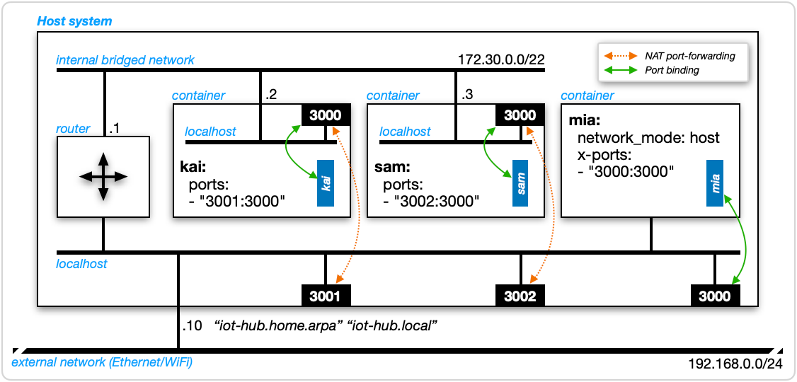
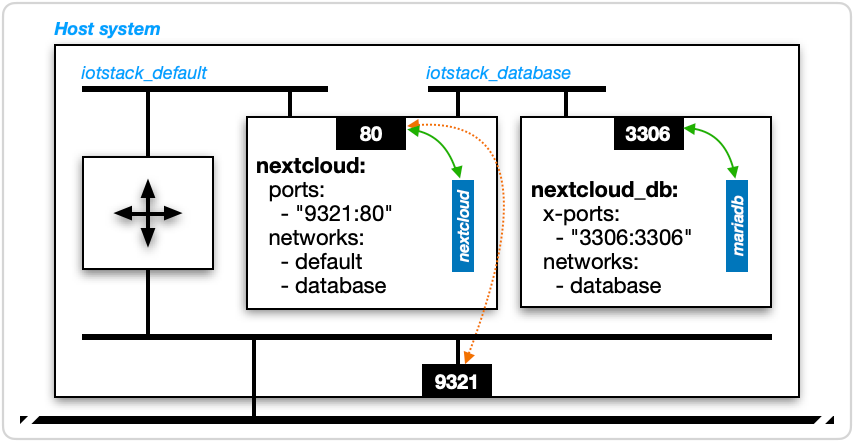

# Networking

As a general statement, *containers* are *contained* which means that pretty much the only way containers can communicate is via TCP/IP. Consequently, it is useful to have a reasonable appreciation for how data-communications works in a Docker environment.

Please refer to Figure&nbsp;1. The outermost box is labelled "Host system". This could be a physical computer like a Raspberry Pi or a virtual computer such as a Debian guest running on a Proxmox-VE system.

| <a name="figure1"></a> Figure 1: Docker networking           |
|:------------------------------------------------------------:|
| |

The host can be reached using any or all of the following:

* its IPv4 address 192.168.0.10
* its hostname "iot-hub"
* its fully-qualified domain name (FQDN) "iot-hub.home.arpa"
* its multicast domain name system (mDNS) name "iot-hub.local".

	> The diagram depicts a single network interface but it's fairly common to have more than one, such as a Raspberry Pi connected to both Ethernet and WiFi.

This host is running three Docker *containers* named "kai", "sam" and "mia".

TCP/IP is a client-server model: clients initiate "connections" and servers respond. Although processes running inside containers can be both *clients* and *servers*, our focus here is on *server processes*.

Each container is running a single server process named for its container. The blue boxes with white lettering rotated 90° represent those server processes. It's important to realise that a *container* and a server *process* running inside a container are not the same thing, irrespective of whether they have the same or different names.

Server processes (not containers) bind to network ports where they listen for incoming requests and take some appropriate action in response (eg a web server receiving an HTTP request and responding with HTML for a browser to interpret and display to a user).

## non-host mode

Two of the containers ("kai" and "sam") are running in what is called *non-host mode*. This is the result of the **absence** of a `network_mode: host` clause from each container's service definition.

### port mapping

In non-host mode, `ports:` clauses come into play. Here is the one for "kai":

``` yaml
ports:
- "3001:3000"
```

The second line is called a *port mapping* and the general syntax is:

``` yaml
- "«hostPort»:«containerPort»"
```

??? info "(advanced) extended forms"

	Ports can be described using both *short syntax* and *long syntax*. Refer [docker compose ports](https://docs.docker.com/reference/compose-file/services/#ports) documentation.

	IOTstack uses short syntax because, thus far, there has never been a need for a feature that demands the use of long syntax. The general form of short syntax is:

	``` yaml
	"{«interface»:}«hostPort»:«containerPort»{/«protocol»}"
	```

	where:

	* `«interface»` defaults to "0.0.0.0" (meaning "all interfaces on this host")
	* `«hostPort»` and `«containerPort»` are port numbers
	* `«protocol»` defaults to "tcp"

	Thus the short-syntax form `"3001:3000"` is actually a contraction of:

	``` yaml
	- "0.0.0.0:3001:3000/tcp"
	```

	The only times you will need to specify an `«interface»` is:

	* If you want to prevent a container from receiving traffic on a particular interface. For example, if you don't want traffic arriving over WiFi but you still want WiFi to be active, you would specify the IP address of the Ethernet interface.
	* If you don't want the service to be reachable from beyond the host on which it is running, in which case you use 127.0.0.1 (not "localhost").

	Similarly, the only time you will need to specify "udp" for the protocol is if the service expects it. If a service expects both, it is best to be explicit. For example:

	``` yaml
	ports:
	  - "53:53/tcp"
	  - "53:53/udp"
	```

### container port

The number on the right hand side of the port mapping (3000) is called the *container port*, also sometimes known as the *internal port*.

The container port sets an **expectation**, for both Docker and human readers, that the "kai" server process binds to container port 3000. It does not, however, either force the server process to bind to that port or check that the port is bound once the container starts. The server process actually has no idea that it is running inside a container. It will bind to whatever port (or ports) it wants. Sometimes a port number will be hard-coded into the process' source code. Sometimes it can be controlled via an environment variable. Other times the process may consult a "config" file to determine which port to use.

??? note "(note) additional information"

	I don't want to leave you with the impression that there's a kind of Wild West where the actual ports claimed by server processes frequently differ from the expectations set by `ports:` clauses. Almost always everything is properly aligned and "just works". It is, however, important to understand what a `ports:` clause does and does not do. If you are developing a new service definition or if you have a good reason for telling a server process to bind to a different container port, you need to follow through and make sure that port mappings accurately reflect what the server process is actually doing.  

### host port (explicit)

The number on the left hand side of the port mapping ("3001") is called the *host port*, also sometimes known as the *external port*.

The port mapping "3001:3000" causes Docker to set up a port-forwarding rule such that traffic arriving on host port 3001 is forwarded to port 3000 of the "kai" container.

<a name="other-host-perspective"></a>
Traffic passing between host port 3001 and container port 3000 is also subject to Network Address Translation (NAT). What this means is that, from the perspective of *another* host, the "kai" server process is reachable at any of the following:

* `192.168.0.10:3001`
* `iot-hub:3001` <sup>†</sup>
* `iot-hub.home.arpa:3001` <sup>†</sup>
* `iot-hub.local:3001` <sup>†</sup>

	<sup>†</sup> assuming the other host can resolve the hostname, fully-qualified domain name, or multicast domain name.

??? info "(advanced) iptables"

	Docker uses `iptables` to set up both the NAT and port-forwarding rules. Once you have a stack up and running, you can see these rules by running: 

	``` console
	$ sudo iptables -t nat -L -n
	```

### generalisation

Thus far we've only discussed the "kai" container but the same applies to the "sam" container, save that its host port is "3002".

## host mode

The "mia" container, on the other hand, is running in *host mode*. This is the result of the **presence** of the `network_mode: host` clause in its service definition.

When a container is running in host mode, port mappings are irrelevant. Indeed, if you include a `ports:` clause, docker compose will complain and tell you to remove it.

### `x-ports:` clause

For host-mode containers, IOTstack follows the convention of using an `x-ports:` clause. This example is from ESPHome:

``` yaml
network_mode: host
x-ports:
  - "6052:6052"
```

The `x-` prefix has the effect of commenting-out both the header and body of the entire clause. IOTstack also follows the convention of writing whichever port(s) the server process binds to on each side of the pseudo port mapping. Together, these conventions both document which host port(s) are likely to be claimed when a host-mode container is brought up, and also facilitate maintenance of the [default ports](./Default-Configs.md) list.

However, as with a port mapping for a non-host mode container, nothing in an `x-ports:` clause forces a process running within a host-mode container to bind to a particular port.

A related IOTstack convention is this example from Pi-hole v6:

``` yaml
x-network_mode: host
ports:
  - "8089:80/tcp"
  - "53:53/tcp"
  - "53:53/udp"
  - "67:67/udp"
```

This pattern means that the service definition, as shipped, expects that container will normally be run in non-host mode but that the container is also capable of running in host mode. In the case of Pi-hole, non-host mode is appropriate if you only need DNS and ad-blocking services. If and only if you also need Pi-hole to provide DHCP services on your network should it be run in host mode. To activate host mode, you would "move the `x-` prefix", like this:

``` yaml
network_mode: host
x-ports:
  - "8089:80/tcp"
  - "53:53/tcp"
  - "53:53/udp"
  - "67:67/udp"
```

See also [private container ports](#privateContainerPorts) for another convention where `x-ports:` is used for a non-host mode container. 

### host port (implied)

The "mia" process running within the host-mode container binds directly to host port 3000. No port-forwarding and no Network Address Translation is involved. Another host can reach the "mia" process at port 3000 in the same way as the "kai" and "sam" processes are reachable at ports 3001 and 3002, respectively.

## about port 3000

The port number 3000 used in [Figure&nbsp;1](#figure1) has no significance in and of itself. It could have been any number. The example is artificial and was deliberately constructed so that all three server processes ("kai", "sam" and "mia") were listening to the same port. That said, this design would actually work in practice because of the distinction between *host* and *container* ports:

* A non-host mode container is best visualised as a small self-contained computer with its own ports and processes running "within" it; whereas

* A host-mode container binds to the ports of the host on which it is running. It is best understood as being no different to a native installation of the same process.

	??? info "(definition) native installation"

		If the term "native installation" doesn't make sense, think of it like this. When you install a process *natively* you typically use the `apt install` command, keep the package up-to-date using `apt upgrade`, and usually manage the process with `systemctl`.

		Running the same process in a container is accomplished using docker compose, which handles everything to do with installation, management and upgrade.

Any number of non-host mode containers can use the same container port because *containerName:containerPort* syntax provides all necessary disambiguation. Conversely, host ports must be unique.

Any host-mode container must take priority when claiming a particular port, which is why "mia" gets host port 3000. Any non-host mode containers using the same port number must be port-mapped, which is why "kia" and "sam" take 3001 and 3002, respectively (or, indeed, any other host port numbers that haven't been claimed by something else).

## port conflicts

Which brings us to another IOTstack convention. IOTstack makes a best-efforts attempt at resolving potential port conflicts in advance. To this end, IOTstack uses a "first come, first served" approach, meaning that a newer container wanting a particular host port number must yield to any existing container that has already claimed that port number. 

The only known exceptions to this rule are Pi-hole and AdGuardHome, which utilise the same ports. For those, you can only run one container, not both.

## client processes

Thus far, this discussion has focused on how an external host reaches the three server processes. It is, however, frequently the case that a process running in a container will also need to be a client. Some very good examples are:

* The Node-RED container needs to be able to:

	- subscribe to topics managed by the Mosquitto broker
	- tell the InfluxDB container to insert data into a time-series

* The Grafana container needs to be able to query the InfluxDB container to retrieve time-series data which it then formats into charts and tables.

For precision, the rules below apply to any pair of containers running on the **same** host, providing that if **both** containers are running in non-host mode, they must also share a common internal bridged network. For IOTstack, this is always the default condition.

The rules are:

1. Two non-host mode containers = *containerName:containerPort* syntax:

	If a client process in a non-host mode container needs to be able to reach a server process in another non-host mode container, it uses the name of the container where the server process is running, plus the container port. For example, a client process running in the "kai" container reaches the "sam" server process as:

	```
	sam:3000
	```

	??? info "(advanced) container name to IP address lookup"

		The mapping between container names like "sam", and the (random) IPv4 address Docker allocates to each container when it is instantiated, are all managed by Docker. You do not need to worry about it.

2. Non-host mode to host mode container = *magicName:hostPort* syntax:

	If a client process in a non-host mode container needs to be able to reach a server process in a host-mode container, it needs an "assist" in the form of an `extra_hosts:` clause in its service definition. By convention, that is:

	``` yaml
	extra_hosts:
	  - "host.docker.internal:host-gateway"
	```

	Assume that clause has been added to the service definition for "kai". A client process running within the "kai" container can then reach the "mia" server process using:

	```
	host.docker.internal:3000
	```

	??? info "(advanced) other uses of `extra_hosts`"

		Suppose you have Node-RED and Mosquitto running on the same host. Node-RED flows will be subscribing to MQTT topics using `mosquitto:1883` (*containerName:containerPort* syntax). Now suppose you need to move one of the containers to a different host. This means `mosquitto:1883` will no longer work. You have two choices:

		1. Edit your flows to replace `mosquitto` with either the IP address or the fully-qualified domain name of the host where the Mosquitto container is running; or
		2. Add an `extra_hosts:` clause to Node-RED's service definition:

			``` yaml
			extra_hosts:
			  - mosquitto:«ipAddress»
			```

			You **must** use the IP address of the host where the Mosquitto container is running. Once that is in place, your Node-RED flows will continue to work without modification.

3. Host-mode container to anything = *localhost:hostPort* syntax:

	If a client process in a host-mode container needs to reach any other server process on the same host, irrespective of whether the server process is running natively, or in a host-mode container, or in a non-host mode container, it uses `localhost` plus the host port associated with the server process. For example, a client process running within "mia" can reach any of the three server processes like this:

	* `localhost:3000` refers to the "mia" server process (ie a self-reference)
	* `localhost:3001` refers to the "kai" server process
	* `localhost:3002` refers to the "sam" server process

4. Self-references = *localHost:serverPort* syntax:

	If a client process running within any container needs to refer to a server process running in the **same** container, it can use `localhost` plus whatever port the server process is bound to. In [Figure&nbsp;1](#figure1), all three server processes are bound to port 3000 so `localhost:3000` has the following meanings:

	* for a client process running in the "kai" container, it means the "kai" server process;
	* for a client process running in the "sam" container, it means the "sam" server process;
	* for a client process running in the "mia" container, it means the "mia" server process.

## localhost depends on context

To put rules 3 and 4 more simply:

* If a container is running in non-host mode, `localhost` means "this container".
* If a container is running in host mode, `localhost` means "this host".

## duplicating the model

Imagine duplicating the host in [Figure&nbsp;1](#figure1) so that you have two hosts where the only differences are the IP address assigned to the second host (eg 192.168.0.11) plus a distinct host name (eg `iot-two`).

That second host (`iot-two`) and the containers it is running **all** have the ["perspective of another host"](#other-host-perspective) mentioned earlier. Whether a client process is running natively, or in a host-mode container, or in a non-host mode container, is irrelevant.

The server processes running on `iot-hub` are reached using its IP address, host-, domain- or multicast-name plus the host port associated with the server process. Ditto in the other direction for client processes running on `iot-hub` reaching server processes on `iot-two`.

## broadcast domains

In [Figure&nbsp;1](#figure1), please notice the software-defined router on the left hand side which forwards traffic between the host's network and the internal bridged network. The purpose of *routers* is to separate networks into *broadcast domains* (aka "subnets"). A broadcast domain limits the extent to which non-unicast packets can flood throughout interconnected network segments.

This explains why Pi-hole needs to run in host mode if you want it to act as the DHCP server for your network. It is because "DHCP request" frames are broadcast. If Pi-hole is running in non-host mode (like "kai") then the software router will prevent broadcast frames from reaching it. Placing Pi-hole into host mode (like "mia") enables it to receive broadcast frames and construct replies.

Similar comments apply to multicast traffic. Although it is possible to program routers to relay multicast frames, that does not happen with Docker (at least not at the moment). The result is that resolving multicast DNS names like `iot-hub.local` does not work in non-host mode containers.

You should also keep in mind that both the IP subnets allocated to the internal bridged networks and the IP addresses allocated to containers when they launch are (essentially) random. You can't rely on a non-host mode container's IP address being invariant.

## private database network

| <a name="figure2"></a> Figure 2: Private Database Network            |
|:--------------------------------------------------------------------:|
| |

Figure&nbsp;2 removes much of the clutter and focuses on the arrangement where a user-facing service like NextCloud works in conjunction with a private database server (in this case, MariaDB):

* An external client wanting to reach the NextCloud service references host port 9321, which is port-forwarded to the "nextcloud" container port 80, where the "nextcloud" process is listening.

* When the "nextcloud" process wants to communicate with its MariaDB back-end, it uses the *containerName:containerPort* syntax:

	```
	nextcloud_db:3306
	```

	Although it does not happen in practice, if the MariaDB engine wanted to initiate communications in the other direction, it would use the same syntax:

	```
	nextcloud:80
	```

* The "nexcloud_db" container is only exposed to containers that are attached to the `iotstack_database` internal bridged network. The same is true in reverse in that the "nexcloud_db" container can only reach containers that are attached to the `iotstack_database` network.

	??? info "(advanced) network names"

		The `iotstack_` prefix on both `iotstack_default` and `iotstack_database` is the docker compose *project name*, which is the all-lower-case representation of the directory holding the compose file.

### private container ports { #privateContainerPorts }

[Figure&nbsp;2](#figure2) also reveals another IOTstack convention. The `nextcloud_db` container runs in non-host mode yet its service definition includes:

``` yaml
x-ports:
  - "3306:3306"
```

In this case, the container port the server process binds to is written on each side of the port mapping. The `x-` prefix makes the clause inactive but it still serves the purpose of documenting which port MariaDB is listening on.

## reverse-proxy considerations

Suppose you wanted to set up a reverse proxy service such as Nginx on the host shown in [Figure&nbsp;1](#figure1). Nginx is a non-host mode container. You would need proxy-host rules like this:

Source                      | Destination
----------------------------|---------------------------------
https://mia.home.arpa       | http://host.docker.internal:3000
https://kai.home.arpa       | http://kai:3000
https://sam.home.arpa       | http://sam:3000
https://nextcloud.home.arpa | http://nextcloud:80

This also makes the point that, where a container offers a web front end or other interface which is commonly associated with Transport Layer Security (TLS), **most** containers default to HTTP. Some, but by no means all containers support HTTPS, either in parallel or as an alternative. If you intend to go down the path of enabling HTTPS everywhere, you will have to get comfortable figuring out where you need SSL certificates and how to deploy them. I don't think it's an overstatement to say that it can seem like the designers of every container adopted different approaches to doing this. It's quite the minefield. 

## about 127.0.0.11

If you are nosing around inside a non-host mode container, you may come across the IPv4 address `127.0.0.11`. This is a special address managed by Docker which provides name-resolution services for containers.

In a formal sense, a container name is an unqualified domain name, such as `fred`, as distinct from a fully-qualified domain name like `fred.home.arpa`.

!!! note
	* The difference between an unqualified and fully-qualified domain name comes down to "dots". By default, if a string contains at least one period then it is considered to be fully-qualified.

Outside *Dockerspace* you may be used to seeing unqualified domain names first being treated as hostnames (being looked-up in `/etc/hosts`) and then having a search domain appended to form a fully-qualified domain name which is passed to the Domain Name System (DNS) for resolution.

Inside *Dockerspace*, unqualified domain names are treated as container names. If no container of that name is running, resolution fails. There is no concept of appending a search domain. Fully-qualified domain names, on the other hand, are relayed to whatever the host is using for its DNS resolution. This is something you may need to be aware of when provisioning containers.
