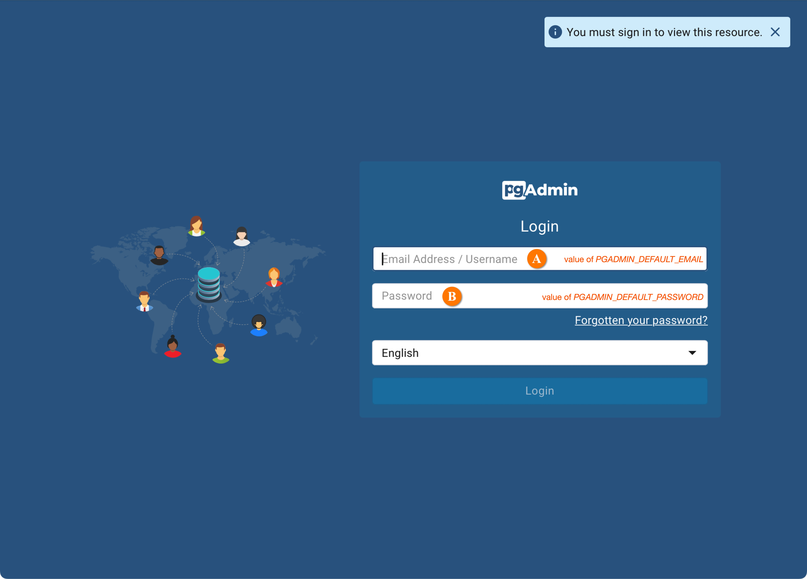
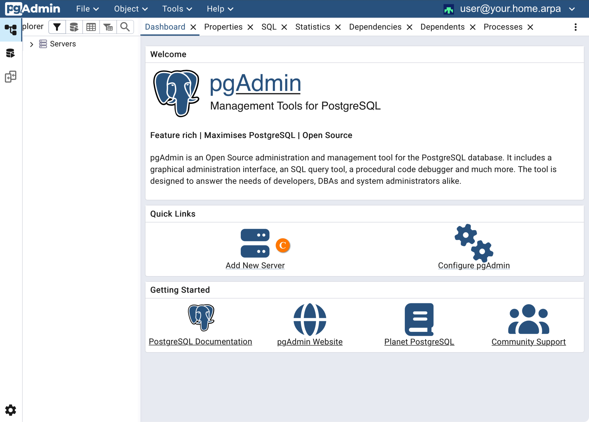
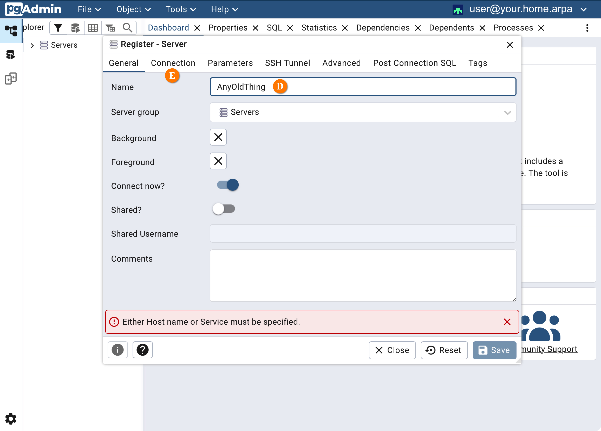
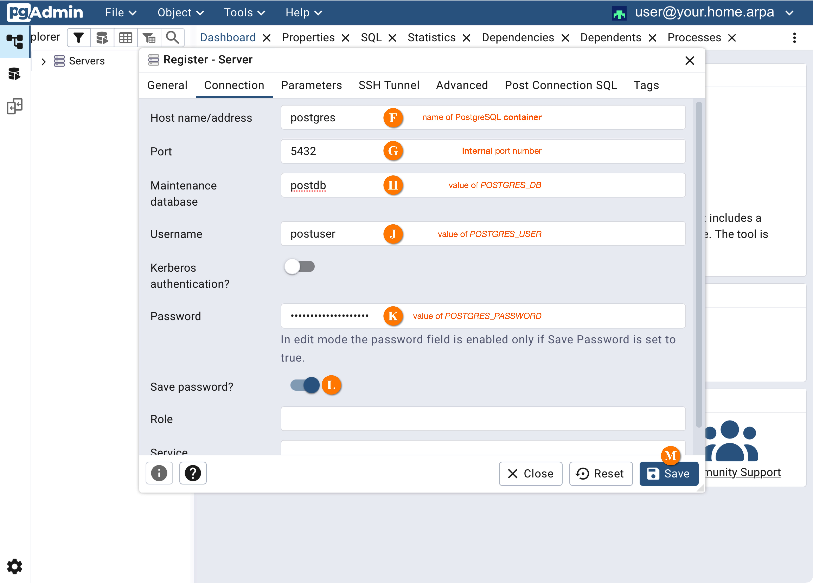
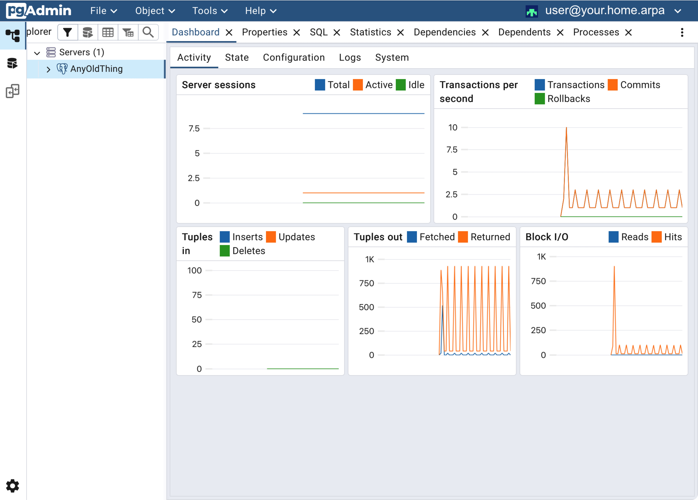

# pgAdmin4

## References

- [Docker Hub](https://hub.docker.com/r/dpage/pgadmin4)
- [GitHub](https://github.com/pgadmin-org/pgadmin4)
- [pgAdmin4 home page](https://www.pgadmin.org)

## About

pgAdmin4 is a graphical user interface to PostgreSQL.

## Installation

To install pgdmin4, either use the menu:

* Services » pgadmin4 » Install
* Build

or the command line:

``` console
$ ./iotstack-menu.sh install pgadmin4 
$ ./iotstack-menu.sh build
```

## Local Image

The installation instructions at [pgadmin4/container-deployment](https://www.pgadmin.org/docs/pgadmin4/latest/container_deployment.html#container-deployment) do work but are suboptimal. The IOTstack ethos is that containers should, to the maximum extent possible, work "out of the box", and should also be capable of re-initialising properly from a clean slate.

The specific issues are with the default deployment (at the time of writing):

1. The expectation that users necessarily understand the either significance of this instruction or the specific mechanics of putting it into action:

	> Warning: pgAdmin runs as the pgadmin user (UID: 5050) in the pgadmin group (GID: 5050) in the container. You must ensure that all files are readable, and where necessary (e.g. the working/session directory) writeable for this user on the host machine.

2. The [Examples](https://www.pgadmin.org/docs/pgadmin4/latest/container_deployment.html#examples) are inconsistent with respect to the internal path `/var/lib/pgadmin`. The [Dockerfile](https://github.com/pgadmin-org/pgadmin4/blob/81edb68b27c6488a008fa2f299e3e16ad01b03e0/Dockerfile#L215) declares that path on a `VOLUME` statement. If it is not mapped (the first two examples) then the result is an anonymous volume mount.

3. The third example has a volume mapping for the internal path `/pgadmin4/servers.json`. In all likelihood, that is intended to be a **file**. However, if neither the external nor internal paths are present (the internal path doesn't exist in the image at the time of writing) then the structure is set up as a **folder**.

The implementation shipped with IOTstack solves these problems via the use of a Dockerfile plus a custom entry-point script. The theory of operation is:

* The `dpage/pgadmin4` image is used as the base.
* The Dockerfile adds:

	- rsync
	- the custom entry-point script, and
	- caches a copy of the `/pgadmin4` directory.

* The custom entry-point script:

	- invokes `rsync` to repopulate the `/pgadmin4` directory from the cache. On first launch, this implies a full copy operation. On subsequent launches, it is a self-repair operation.
	- creates a placeholder file for `servers.json`.
	- enforces correct ownership throughout `/pgadmin4`; then
	- execs the original entry-point script.

The original entry-point script completes normal setup and downgrades its privileges to run as (internal) user 5050.  

## Credentials { #credentials }

Two environment variables must be defined when the container launches

1. `PGADMIN_DEFAULT_EMAIL`. This must be a **valid** email address (ask me how I know). You can set it up like this:

	``` console
	$ cd ~/IOTstack
	$ echo "PGADMIN_DEFAULT_EMAIL=user@your.home.arpa" >>.env
	```
	
2. `PGADMIN_DEFAULT_PASSWORD`. The IOTstack menu will generate a random value for this password if one does not exist already. You can either accept the random value or edit `.env`.

Please keep in mind that the values you define here only apply the first time you launch the PostgreSQL container. If you change any of these in PostgreSQL, you will have to make matching changes in pgAdmin4.

## First run

To launch the container for the firs time:

``` console
$ cd ~/IOTstack
$ docker compose up -d pgadmin4
```

This will run the Dockerfile to produce the local image, then instantiate that image as the running container.

The container takes quite some time to get going (a minute or so on a Raspberry Pi 4). It is usually a good idea to monitor the container's log while waiting for it to become ready:

```
$ docker logs -f pgadmin4
```

You can terminate the log using <kbd>control</kbd>+<kbd>c</kbd>.

The next few instructions assume that you have selected the `postgresql` container from the IOTstack menu, and that that container is running.

Complete the following steps:

1. Use your web browser to connect to pgAdmin4 on port `5050`. For example:

	* `http://raspberrypi.local:5050`

	As noted above, the pgAdmin4 service takes a while to start so please be patient if you have only just launched the container. Once your browser is able to connect to pgAdmin4 successfully, you will be asked to enter a username and password:

	

2. Enter the username <!--A-->&#x1F150; and password <!--B-->&#x1F151; [credentials](#credentials) defined above. After login, the home screeen will be displayed:

	

3. Click "Add New Server" <!--C-->&#x1F152;. This displays the server registration sheet, starting with the "General" tab:

	

4. Give the server a name at <!--D-->&#x1F153;. The name is not important. It just needs to be meaningful to you.

5. Click the "Connection" tab <!--E-->&#x1F154; to display that screen:

	

6. Enter the name of the PostgreSQL container at <!--F-->&#x1F155; (ie "postgres").

7. The default port at <!--G-->&#x1F156; is 5432. This is the **internal** port number the PostgreSQL container is listening on. It is unlikely that you will need to change this.

8. In the "Maintenance database" field <!--H-->&#x1F157;, enter the *value* of the `POSTGRES_DB` environment variable as it applies to the PostgreSQL container (ie `postdb`).

9. In the "Username" field <!--J-->&#x1F159;, enter the *value* of the `POSTGRES_USER` environment variable as it applies to the PostgreSQL container (ie `postuser`).

10. In the "Password" field <!--K-->&#x1F15A;, enter the *value* of the `POSTGRES_PASSWORD` environment variable as it applies to the PostgreSQL container. The menu will have auto-generated a random password into `.env` and you will know whether you edited the value.

11. Enable the "Save password" switch <!--L-->&#x1F15B; if you think that is appropriate.

12. Click the "Save" button <!--M-->&#x1F15C;. If all goes well, you will be connected to the dashboard for the database:

	


## Additional configuration

We recommend using an [override file](../Basic_setup/Custom.md#custom-service) file to make configuration changes. You should create a file at the path:

```
~/IOTstack/services/pgadmin4/override.yml
```

### environment variables

Here is an example setting some supported [Environment Variables](https://www.pgadmin.org/docs/pgadmin4/latest/container_deployment.html#environment-variables):

``` yaml
pgadmin4:
  environment:
    PGADMIN_CONFIG_ENHANCED_COOKIE_PROTECTION: True
    PGADMIN_CONFIG_CONSOLE_LOG_LEVEL: 10
```

Key point:

*	Please note the use of "colon syntax" in the above example. The examples in the pgAdmin4 documentation all use "equals syntax". The only place where you can safely use "equals syntax" is in the `.env` file. You run the risk of confusing `docker compose` if you do not use "colon syntax" in YAML files.

### pinning to a version

You can also use an override file to pin to a specific version of pgAdmin4. For example:

``` yaml
pgadmin4:
  build:
    args:
      - DOCKERHUB_TAG=9.18.0
```

### applying changes

To apply changes made using an override file:

``` console
$ cd ~/IOTstack
$ ./iotstack-menu.sh build
$ docker compose up -d pgadmin4
```

## Container maintenance

Because pgadmin4 is instantiated from a local image, it requires special treatment whenever the base image is updated on DockerHub:

``` console
$ cd ~/IOTstack
$ docker compose build --no-cache --pull pgadmin4
$ docker compose up -d pgadmin4
```

