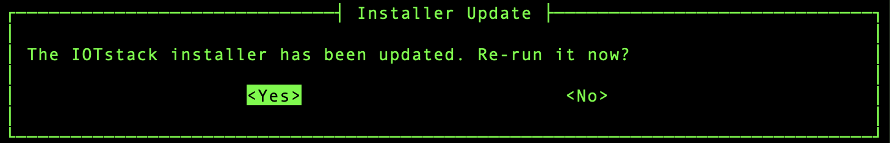
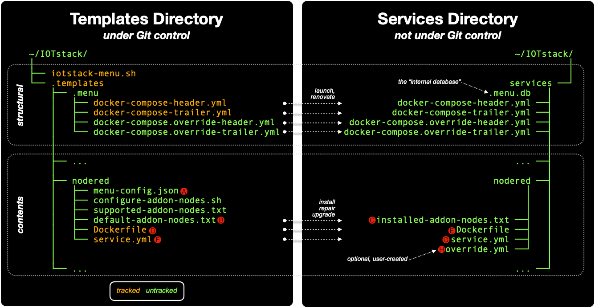
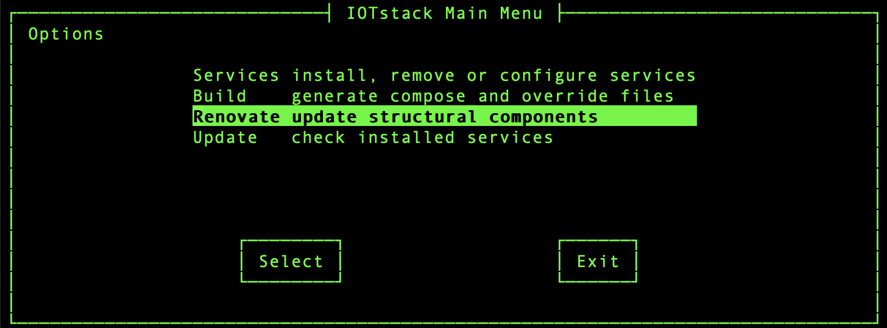
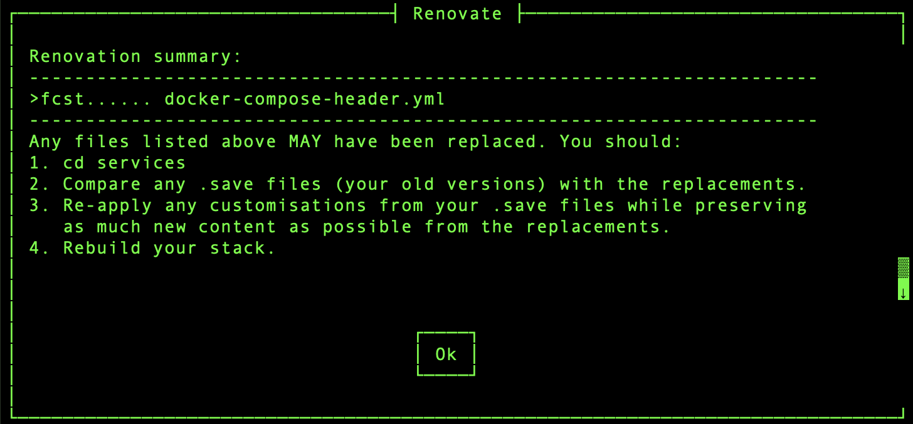
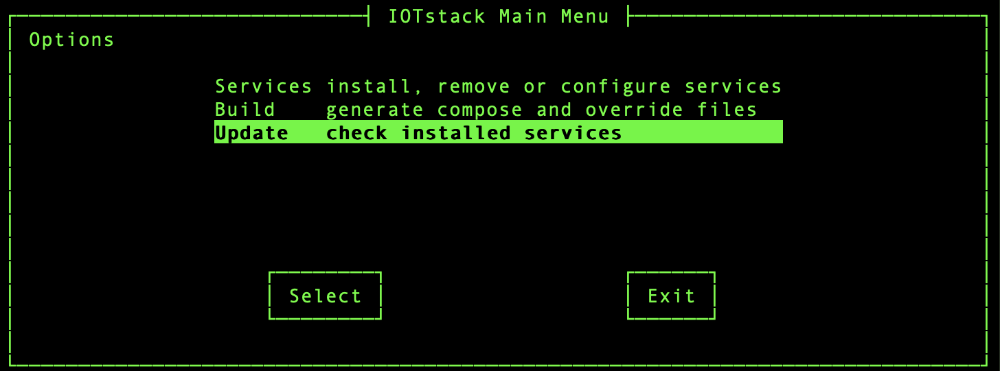
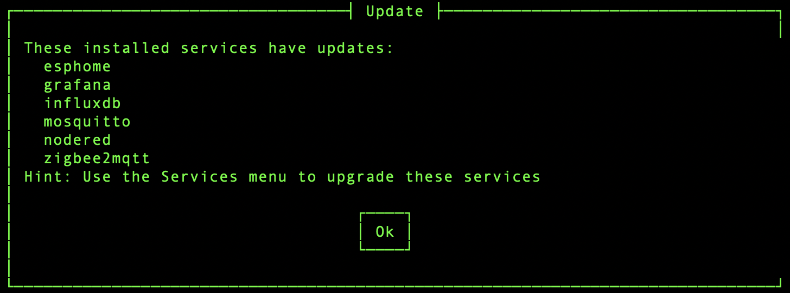
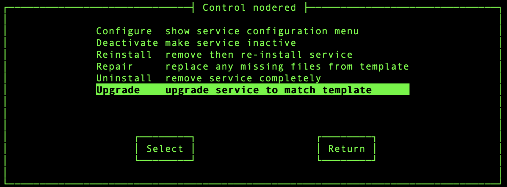
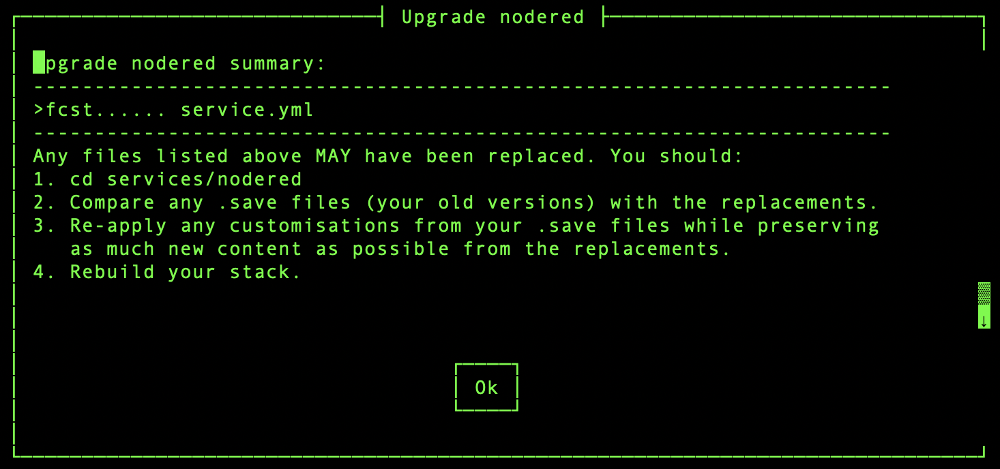

# Stack maintenance

Your stack is constructed from two primary sources:

* the [IOTstack](https://github.com/SensorsIot/IOTstack) project on github.com; and
* Docker image registries, such as [hub.docker.com](https://hub.docker.com).

Initial stack creation is straightforward because all the Docker-related steps are handled automatically. Thereafter, the menu adopts a philosophy of leaving you in control. It does not force you to update anything. It may *remind* you that something needs to be done but, in general, lets you proceed at your own pace, which means you need to perform the various steps explicitly.

## operating system { #maint-os }

You should keep your host's operating system up-to-date. Despite the word "container" suggesting that *containers* are fully self-contained, they sometimes depend on operating system components.

``` console
$ sudo apt update
$ sudo apt upgrade -y
$ sudo apt autoremove -y
```

## GitHub { #maint-github }

If you want to check whether the master version of IOTstack on GitHub has changed, run:

``` console
$ cd ~/IOTstack
$ git fetch
$ git status
```

If the response to the `status` command says "Your branch is behind" by some number of commits then, providing it is convenient for you to do so, you can synchronise your local clone with GitHub by running:

``` console
$ cd ~/IOTstack
$ git pull
```

## IOTstack installer { #maint-install }

On each launch, the menu checks whether the installer script should be re-run. In general, this will only happen after an initial installation or following a `git pull`.

As well as setting up the basic scaffolding for *Docker*, the installer script is the primary delivery vehicle for ensuring dependencies are in place so, as a general statement, it is prudent to let the installer run when necessary.

In menu mode, the menu will offer you a choice:

| <a name="figure1"></a> Figure 1: Installer Update menu      |
|:-----------------------------------------------------------:|
| |

In command-line mode, a reminder message is written to `stderr`:

```
Warning: /home/pi/IOTstack/install.sh needs to be re-run.
```

To run the installer by hand:

``` console
$ cd ~/IOTstack
$ ./install.sh
```

Note:

* The installer can only do so much. In particular, if you have fairly ancient installations of *Docker* and/or *docker&nbsp;compose*, you might need to use some brute force. You may find it helpful to read [Maintaining docker + docker compose](https://github.com/Paraphraser/PiBuilder/blob/master/docs/reinstallation.md) which is part of [PiBuilder](https://github.com/Paraphraser/PiBuilder).

Tip:

* If you have a good reason for not wanting to run the installer, you can silence the reminders like this:

	``` console
	$ ./install.sh version >.new_install
	```

	This fakes your system into believing that the updated version of the installer has already run.

## internal database { #maint-database }

The menu reloads its internal database automatically when either of the following is true:

1. The internal database does not exist; or
2. The commit&nbsp;ID of the *templates* directory changes.

Those events cover the following use-cases:

1. When you clone IOTstack for the first time;
2. When you have an existing IOTstack but use `iotstack-menu.sh` for the first time; and
3. When you have done a `git pull`, which has caused a change somewhere in the *templates* directory.

You can also reload the internal database manually by running:

``` console
$ cd ~/IOTstack
$ ./iotstack-menu.sh reload
```

See also [Internal Database](../Developers/Internal-Database.md).

## structure vs contents { #structure-vs-contents }

Think of a house. You have the building's *structure* and the *contents* within. The menu makes similar distinctions:

* The *structural* components are the items grouped in the upper part of [Figure&nbsp;2](#figure2):

	- the menu script itself;
	- the `.templates` **directory** (as distinct from the sub-directories and files contained within it); and
	- the header and trailer files which are copied from the *templates* directory into the top level of the *services* directory.

* The *contents* components are the files that define the *services* you install. Installation of a service involves copying one or more files from the service's *template* into the service's sub-directory of the *services* directory. The lower part of [Figure&nbsp;2](#figure2) uses Node-RED as its example where three files are copied when that service is installed.

| <a name="figure2"></a> Figure 2: File structures |
|:------------------------------------------------:|
|  |

If you need to do some work on the structure of your home, you usually talk about *renovations*. If an item of contents needs some work, you typically talk in terms of repairs or replacing the old item with a newer model (ie an *upgrade*). The menu adopts the same terminology. If a change from GitHub that needs to be propagated into your working stack affects:

* a *structural* component, the relevant concept is *renovate*.

* a *contents* (service) component, the relevant concept is *upgrade*.

The menu distinguishes between *structure* and *contents* to minimise risk. Although *renovate* and *upgrade* serve similar purposes (propagating changes made on GitHub into your working stack), changes to *structural* components affect your whole stack so there's a greater chance of a foul-up than there is if you're only upgrading a service.

### tracked files { #tracked-files }

A file is said to be *tracked* if its Git commit&nbsp;ID is recorded in the menu's internal database at the time when the menu makes a copy of that file. [Figure&nbsp;2](#figure2) summarises which files are *tracked*. 

If a *tracked* file's Git commit&nbsp;ID changes subsequently, it signals that the content of the original file has changed, and it implies that the copy of the file made by the menu when the commit&nbsp;ID was recorded is now out of date.

The reason the menu makes copies of files (typically by copying from the *templates* directory into the *services* directory) is so that the destination copies (which are **not** under Git control) can be customised, by you, without affecting the originals (which **are** under Git control). It follows that, while a copy always starts out being identical to its original, it does not necessarily stay that way.

When you tell the menu to "Renovate" the header/footer structural components or "Upgrade" a service, the menu only considers *tracked* files. If the newly-updated version of a *tracked* file differs from an existing file, the existing file is renamed with a `.save` extension before the updated version is installed. This gives you the opportunity to compare the old and new files, and decide whether it is necessary to re-apply any customisations.

Developer guide references:

* The [components table](../Developers/Internal-Database.md#theory-db-components) records Git commit&nbsp;IDs for structural files;
* The [tracking table](../Developers/Internal-Database.md#theory-db-tracking) records Git commit&nbsp;IDs for services ("contents") files while the [`"install":` array](../Developers/Add-Service.md#json_install) in each service's `menu-config.json` defines which files are *tracked*.

## renovation { #maint-structural }

On first launch, the menu copies the four header and trailer files shown in [Figure&nbsp;2](#figure2) into your *services* directory. On subsequent launches, those four files are replaced if they go missing but they are never normally overwritten.

The first two files in the list are tracked. If the master version of one of those files changes, the menu will propose a *renovation*. In menu mode, the menu signals that a renovation is needed by adding the "Renovate" option to the Main menu:

| <a name="figure3"></a> Figure 3: Main menu – Renovate command   |
|:---------------------------------------------------------------:|
| |

In command-line mode, the menu displays:

```
Warning: headers/footers need renovation. Recommend running:
           ./iotstack-menu.sh renovate
         then compare any .save files (your versions) with newer
         replacements, and re-apply your customisations.
```

This includes a hint for the command you should run:

``` console
$ cd ~/IOTstack
$ ./iotstack-menu.sh renovate
```

Choosing either approach will trigger the renovation. The menu will only replace a structural file if it **differs** from the master version, in which case the older file will be renamed with a `.save` extension. The menu summarises its activities like this:

| <a name="figure4"></a> Figure 4: Renovation Summary |
|:---------------------------------------------------:|
|    |

In this example, the "`>fc`" rsync flags indicate that the header file has been replaced so you can infer the existence of a `.save` file. To answer the question "what did the renovation change?" you can (and probably should):

``` console
$ cd ~/IOTstack/services
$ diff -y docker-compose-header.yml.save docker-compose-header.yml
```

This produces a side-by-side display which makes it relatively easy to see if any of your customisations (from the `.save` file) need to be re-applied to the replacement file.

## services { #maint-services }

Please refer back to [Figure&nbsp;2](#figure2) and assume you have installed Node-RED.

When you ask the menu to install a service, the installation process fetches the `.install` array from the service's `menu-config.json` <!--A-->&#x1F150;. In the case of Node-RED, that array contains:

``` console
$ jq -c <.templates/nodered/menu-config.json .install 
[
 {"template":"default-addon-nodes.txt","service":"installed-addon-nodes.txt","tracked":false},
 {"template":"Dockerfile","service":"Dockerfile","tracked":true},
 {"template":"service.yml","service":"service.yml","tracked":true}
]
```

That tells the menu to copy three files:

* `default-addon-nodes.txt` <!--B-->&#x1F151; to `installed-addon-nodes.txt` <!--C-->&#x1F152; (an implied rename);
* `Dockerfile` from <!--D-->&#x1F153; to <!--E-->&#x1F154;; and
* `service.yml` from <!--F-->&#x1F155; to <!--G-->&#x1F156;.

Most services only need `service.yml` to be copied. Node-RED is a fairly special case being used in this example because it copies multiple tracked and untracked files.

The value of `true` for the *tracked* keyword tells the menu to note the Git commit&nbsp;IDs of <!--D-->&#x1F153; and <!--F-->&#x1F155; at the time the copies are made.

If you need to customise Node-RED, you can:

1. Edit `service.yml` <!--G-->&#x1F156;; or
2. Create then edit `override.yml` <!--H-->&#x1F157;; or
3. Do both.

Now, let's suppose <!--D-->&#x1F153; and/or <!--F-->&#x1F155; change on GitHub. Sometime later, you follow the steps in [synchronise with GitHub](#maint-github). Among other things, the Git commit&nbsp;IDs of <!--D-->&#x1F153; and/or <!--F-->&#x1F155; in your local clone of IOTstack will change. Any change of a commit&nbsp;ID for a tracked file causes the menu to conclude that the service has "changed" and is a candidate for being upgraded.

### update check { #maint-services-update }

To check if any of your **installed** services are candidates for upgrading:

1. Either launch the menu and choose the "Update" command:

	| <a name="figure5"></a> Figure 5: Main menu – Update command |
	|:-----------------------------------------------------------:|
	| |

2. Or run:

	``` console
	$ cd ~/IOTstack
	$ ./iotstack-menu update
	```

If no services are candidates for upgrading, the menu will report:

```
All installed services are up-to-date!
```

Otherwise any services that can be upgraded will be listed:

| <a name="figure6"></a> Figure 6: Update summary |
|:-----------------------------------------------:|
|      |

If you're wondering why the Services menu doesn't contain some indication of the upgradability of all services, it is because it is a relatively expensive operation. Checking every installed service every time the Services menu is rebuilt imposes an unacceptable performance penalty, particularly on low-end systems. That's why a separate "Update" command is provided in the Main menu.

### upgrade service { #maint-services-upgrade }

If the response from the "Update" command suggests that a service has changed, you can upgrade it. For example, if Node-RED has changed, you can upgrade it by either by:

* In menu mode:

	1. Choose "Services" from the Main menu;
	2. Choose "nodered" in the Services menu;
	3. Choose the "Upgrade" command:

	| <a name="figure7"></a> Figure 7: Upgrade Node-RED – command        |
	|:------------------------------------------------------------------:|
	| |

* In command line mode:

	``` console
	$ cd ~/IOTstack
	$ ./iotstack-menu upgrade nodered
	```

During an upgrade, all tracked files (<!--D-->&#x1F153; and <!--F-->&#x1F155;) are compared with their installed counterparts (<!--E-->&#x1F154; and <!--G-->&#x1F156;). If the *upgraded* version of a tracked file differs from its *existing* counterpart then the existing file will be saved with a `.save` extension before the upgraded version is copied into place.

For example, if <!--F-->&#x1F155;; differed from <!--G-->&#x1F156; then the menu would display:

| <a name="figure8"></a> Figure 8: Upgrade Node-RED – summary        |
|:------------------------------------------------------------------:|
| |

To see exactly what changes from GitHub were brought in during the update, you could run:

``` console
$ cd ~/IOTstack/services/nodered
$ diff -y service.yml.save service.yml
```

The `diff -y` command gives a side-by-side view of changes. If you have customised the older version, you can re-apply the changes to the newer version (or move your customisations to an `override.yml` file).

If you never changed <!--G-->&#x1F156; then it is probably safe to accept the new version of <!--F-->&#x1F155; replacing <!--G-->&#x1F156; "as is". Conversely, if you did change <!--G-->&#x1F156; then there's a solid risk that simply accepting the new version of <!--F-->&#x1F155; will lose your customisations. This latter situation is why `override.yml` files are the preferred approach.

## images and containers { #maint-images }

Running *containers* are instantiated from *images*. IOTstack supports two kinds of images:

* a ***base*** image: The container is instantiated from an image that is downloaded from DockerHub or another repository, and is used "as is".

* a ***local*** image: A *base* image is downloaded from DockerHub or another repository, and then a local `Dockerfile` is run to customise that *base* image to produce a *local* image. The *local* image is used to instantiate the container.

There are two easy ways to work out whether a container is instantiated from a *base* or *local* image:

1. Inspect its service definition (`service.yml`). If it contains an `image:` clause then the container is using a *base* image, whereas the presence of a `build:` clause is the signature of a container using a *local* image. Here are two examples:

	* Grafana is instantiated from a base image:

		``` console
		$ cd ~/IOTstack
		$ docker compose config grafana | grep -e "image:" -e "build:"
		image: grafana/grafana
		```

	* Moquitto is instantiated from a local image:

		``` console
		$ cd ~/IOTstack
		$ docker compose config mosquitto | grep -e "image:" -e "build:"
		build:
		```

2. Use docker's `images` command:

	``` console
	$ docker images
	IMAGE                          ID             DISK USAGE
	grafana/grafana:latest         f8a787bf1600       1.01GB    
	influxdb:1.12                  03b8de319bf5        311MB    
	iotstack-mosquitto:latest      2259353e98bd       27.1MB    
	iotstack-nodered:latest        bbfad5db4f91        759MB    
	```
	
	If the image name is prefixed with `iotstack-` then the image is a *local* image; otherwise it is a *base* image. In the above, Grafana and InfluxDB are *base* images while Mosquitto and Node-RED are *local* images.

### maintaining base images { #maint-base-images }

To maintain containers instantiated from *base* images:

``` console
$ cd ~/IOTstack
$ docker compose pull { «container» ... }
$ docker compose up -d { «container» ... }
$ docker system prune -f
```

The [IOTstackAliases](https://github.com/Paraphraser/IOTstackAliases) equivalents are:

``` console
$ PULL { «container» ... }
$ UP { «container» ... }
$ PRUNE
```

Irrespective of whether you use the commands or aliases, if you omit the `«container»` arguments then all *base* images are pulled and instantiated. The `prune` command cleans up the old images.

### maintaining local images { #maint-local-images }

When it comes to maintaining containers instantiated from *local* images, there are two scenarios to consider:

1. You have made a change to one of the inputs into the `Dockerfile` process. At the time of writing, only two containers are candidates for this:

	* Node-RED; and
	* RTL433

	In the case of Node-RED, `installed-addon-nodes.txt` holds the list of add-on nodes and typically changes when you use the menu's "Configuration" command. For RTL433, you might edit the `Dockerfile` to install additional packages.

	Using Node-RED as the example, to apply *local* changes you run:

	``` console
	$ cd ~/IOTstack
	$ docker compose up --build -d nodered
	$ docker system prune -f
	``` 

	The [IOTstackAliases](https://github.com/Paraphraser/IOTstackAliases) equivalents are:

	``` console
	$ BUILD nodered
	$ PRUNE
	```

2. You become aware of a later release of the *base* image which underpins the *local* image, so you want to construct a new *local* image. Using Mosquitto as the example, you run:

	``` console
	$ cd ~/IOTstack
	$ docker compose build --no-cache --pull mosquitto
	$ docker compose up -d mosquitto
	$ docker system prune -f
	```

	The [IOTstackAliases](https://github.com/Paraphraser/IOTstackAliases) equivalents are:

	``` console
	$ REBUILD mosquitto
	$ UP mosquitto
	$ PRUNE
	```
